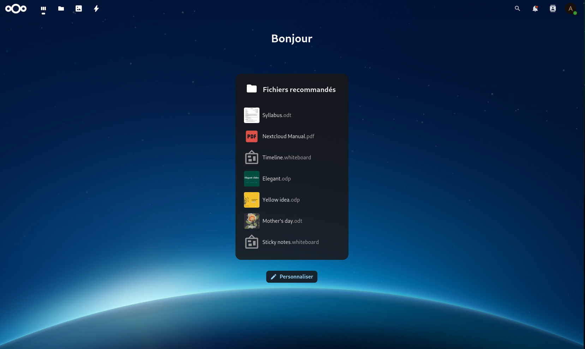
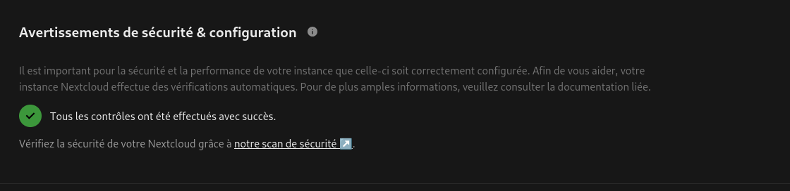

## <a href="nextcloud"></a> Application Nextcloud avec base de donnée MariaDB, Redis et serveur web Caddy.

## 🎯 Objectif

Mettre en place une instance Nextcloud **auto-hébergée**, **accessible uniquement sur le réseau local**, **en HTTPS avec certificat auto-signé**, via un domaine intranet personnalisé (`nextcloud.local.lan`).

---

## 🗂️ Mise en place du répertoire du projet

Pour éviter les erreurs, enregistrement du chemin du répertoire du projet dans une variable :

```bash
# Ajuster si besoin le dossier de la variable `DOCKER_PROJECT_DIR`!
$ DOCKER_PROJECT_DIR=/docker
$ mkdir -p ${DOCKER_PROJECT_DIR}/nextcloud/{apps,config,data,db,nextcloud,redis,secrets,web/{certs,config,data}}
$ sudo chown -R $USER:$USER ${DOCKER_PROJECT_DIR}
$ cd ${DOCKER_PROJECT_DIR}/nextcloud
```

### 📁 Structure du projet

```bash
$ tree -d ${DOCKER_PROJET_DIR}
/docker
└── nextcloud
    ├── apps
    ├── config
    ├── data
    ├── db
    ├── nextcloud
    ├── redis
    ├── secrets
    └── web
        ├── certs
        ├── config
        └── data
```

---

## 📄 Création des fichiers requis

### .env

> 💡 **Note** : Variables d'environnement globales requises pour l'ensemble du projet. A modifier!

Creation du fichier .env avec la commande ci-dessous:

```bash
$ vim ${DOCKER_PROJECT_DIR}/nextcloud/.env
```

<details>
	<summary>.env</summary>
	```.env
	# Le nom du projet est utilisé comme préfixe du nom du conteneur (nom du dossier s'il n'est pas défini)
	COMPOSE_PROJECT_NAME=nextcloud

	# Nom de domaine interne
	DOMAIN=nextcloud.local.lan

	# Version Nextcloud
	NEXTCLOUD_VERSION=apache

	# Version MariaDB
	MARIADB_VERSION=11.4

	# Version redis
	REDIS_VERSION=bookworm

	# Version Caddy
	CADDY_VERSION=2.9.0

	# DH_: Hôte Docker (Docker host) => chemin à personnaliser
	DH_DATA_DIR=./data

	# NC_: Conteneur Nextcloud (Nextcloud container) => chemin à personnaliser
	NC_DATA_DIR=/var/www/html/data

	# A Modifier selon l'utilisateur avec la commande id
	UID=1000
	GID=1000

	# ficher log
	DOCKER_LOGGING_MAX_SIZE=5m
	DOCKER_LOGGING_MAX_FILE=3
	```
</details>

### nextcloud.env

> 💡 **Note** : Ce fichier est utilisé au premier démarrage du conteneur Nextcloud [app] pour créer le fichier config.php. Les changements ne sont pas appliqués une fois que le conteneur a démarré une fois !

Creation du fichier nextcloud.env avec la commande ci-dessous:

```bash
$ vim ${DOCKER_PROJECT_DIR}/nextcloud/nextcloud.env
```

<details>
	<summary>nextcloud.env</summary>
	```nextcloud.env
	# nextcloud FQDN - public DNS
	NEXTCLOUD_TRUSTED_DOMAINS=${DOMAIN}

	# reverse proxy configuration
	OVERWRITEHOST=${DOMAIN}
	OVERWRITECLIURL=https://${DOMAIN}
	OVERWRITEPROTOCOL=https

	# all private IPs - excluded for now: 192.168.0.0/16 10.0.0.0/8 fc00::/7 fe80::/10 2001:db8::/32
	TRUSTED_PROXIES=172.19.0.0/16

	# nextcloud data directory
	NEXTCLOUD_DATA_DIR=${NC_DATA_DIR}

	# db
	MYSQL_HOST=db
	MYSQL_PASSWORD_FILE=/run/secrets/db_user_password
	MYSQL_DATABASE_FILE=/run/secrets/db_name  									# nextcloud
	MYSQL_USER_FILE=/run/secrets/db_user 									    	# nextcloud

	# admin user
	NEXTCLOUD_ADMIN_PASSWORD_FILE=/run/secrets/nextcloud_admin_password
	NEXTCLOUD_ADMIN_USER_FILE=/run/secrets/nextcloud_admin_user

	# smtp (example with gmail)
	SMTP_HOST=smtp.gmail.com
	MAIL_FROM_ADDRESS=username
	MAIL_DOMAIN=gmail.com
	SMTP_PORT=465
	SMTP_SECURE=ssl
	SMTP_NAME=username@gmail.com
	# SMTP_PASSWORD=
	SMTP_PASSWORD_FILE=/run/secrets/smtp_user_password
	SMTP_AUTHTYPE=1

	# redis
	REDIS_HOST=redis
	REDIS_HOST_PASSWORD_FILE=/run/secrets/redis_password
	```
</details>

>💡 **Note** : Si besoin supprimer **NEXTCLOUD_DATA_DIR** si non utilsé dans le fichier .env

### 🌐 Webserver (HTTPS interne + restriction IP)

Creation du fichier CaddyFile avec la commande ci-dessous:

```bash
$ vim ${DOCKER_PROJECT_DIR}/nextcloud/web/Caddyfile
```

<details>
	<summary>web/Caddyfile</summary>
	```
	{
		servers :443 {
			protocols h1 h2 h2c
		}
	}

	nextcloud.local.lan {
		@allowed remote_ip 192.168.0.0/24

		request_body {
			max_size 10G
		}

		# Enable gzip but do not remove ETag headers
		encode {
			zstd
			gzip 4

			minimum_length 256

			match {
				header Content-Type application/atom+xml
				header Content-Type application/javascript
				header Content-Type application/json
				header Content-Type application/ld+json
				header Content-Type application/manifest+json
				header Content-Type application/rss+xml
				header Content-Type application/vnd.geo+json
				header Content-Type application/vnd.ms-fontobject
				header Content-Type application/wasm
				header Content-Type application/x-font-ttf
				header Content-Type application/x-web-app-manifest+json
				header Content-Type application/xhtml+xml
				header Content-Type application/xml
				header Content-Type font/opentype
				header Content-Type image/bmp
				header Content-Type image/svg+xml
				header Content-Type image/x-icon
				header Content-Type text/cache-manifest
				header Content-Type text/css
				header Content-Type text/plain
				header Content-Type text/vcard
				header Content-Type text/vnd.rim.location.xloc
				header Content-Type text/vtt
				header Content-Type text/x-component
				header Content-Type text/x-cross-domain-policy
			}
		}

		reverse_proxy app:80 {
	    header_up X-Forwarded-Proto {scheme}
	    header_up X-Forwarded-For {remote_host}
	  }

		header {
			# Based on following source:
			# https://raw.githubusercontent.com/nextcloud/docker/refs/heads/master/.examples/docker-compose/insecure/mariadb/fpm/web/nginx.conf
			#
			# HSTS settings
			# WARNING: Only add the preload option once you read about
			# the consequences in https://hstspreload.org/. This option
			# will add the domain to a hardcoded list that is shipped
			# in all major browsers and getting removed from this list
			# could take several months.
			# Strict-Transport-Security "max-age=15768000; includeSubDomains; preload"

			# HTTP response headers borrowed from Nextcloud `.htaccess`
			#Referrer-Policy "no-referrer"
			#X-Content-Type-Options "nosniff"
			#X-Download-Options "noopen"
			#X-Frame-Options "SAMEORIGIN"
			#X-Permitted-Cross-Domain-Policies "none"
			#X-Robots-Tag "noindex,nofollow"
			#X-XSS-Protection "1; mode=block"

			#Permissions-Policy "accelerometer=(), ambient-light-sensor=(), autoplay=(), battery=(), camera=(), cross-origin-isolated=(), display-capture=(), document-domain=(), encrypted-media=(), execution-while-not-rendered=(), execution-while-out-of-viewport=(), fullscreen=(), geolocation=(), gyroscope=(), keyboard-map=(), magnetometer=(), microphone=(), midi=(), navigation-override=(), payment=(), picture-in-picture=(), publickey-credentials-get=(), screen-wake-lock=(), sync-xhr=(), usb=(), web-share=(), xr-spatial-tracking=()"

			# Types MIME manquants
			Content-Type .mjs application/javascript
			Content-Type .otf font/otf
			Content-Type .wasm application/wasm
		}

		tls internal
	}
	```
</details>

### 🔴 Redis

Creation du fichier redis-session.ini avec la commande ci-dessous:

```bash
$ touch ${DOCKER_PROJECT_DIR}/redis/redis-session.ini
```

### ⚙️ Script configuration pour php

Ce fichier sert à ajouter des élements manquant dans le fichier de configuration php **config.php**

Creation du fichier config-inject.sh avec la commande ci-dessous:

```bash
$ vim ${DOCKER_PROJECT_DIR}/nextcloud/config-inject.sh
```

<details>
  <summary>Fichier de configuration config-inject.sh</summary>
  
  ```bash
  #!/bin/bash
  set -e

  CONFIG_FILE=./config/config.php
  BACKUP_FILE="${CONFIG_FILE}.bak"
  TMP_FILE="$(mktemp)"
  INSERT_BLOCK=""

  # Vérifie si le fichier existe
  if [ ! -f "$CONFIG_FILE" ]; then
    echo "❌ Fichier $CONFIG_FILE introuvable !"
    exit 1
  fi

  # 🔒 Sauvegarde
  cp "$CONFIG_FILE" "$BACKUP_FILE"
  echo "📦 Sauvegarde faite : $BACKUP_FILE"

  # Tableau associatif des clés à injecter
  declare -A CONFIG_ENTRIES=(
    ["'maintenance_window_start'"]="1"
    ["'maintenance'"]="false"
    ["'enable_previews'"]="true"
    ["'enabledPreviewProviders'"]="array (
      0 => 'OC\\\\Preview\\\\PNG',
      1 => 'OC\\\\Preview\\\\JPEG',
      2 => 'OC\\\\Preview\\\\GIF',
      3 => 'OC\\\\Preview\\\\BMP',
      4 => 'OC\\\\Preview\\\\XBitmap',
      5 => 'OC\\\\Preview\\\\MP3',
      6 => 'OC\\\\Preview\\\\TXT',
      7 => 'OC\\\\Preview\\\\MarkDown',
      8 => 'OC\\\\Preview\\\\OpenDocument',
      9 => 'OC\\\\Preview\\\\Krita',
      10 => 'OC\\\\Preview\\\\HEIC',
    )"
    ["'default_phone_region'"]="'FR'"
  )

  # Vérifie si chaque clé est déjà présente
  for key in "${!CONFIG_ENTRIES[@]}"; do
    if ! grep -q "$key" "$CONFIG_FILE"; then
      value=${CONFIG_ENTRIES[$key]}
      INSERT_BLOCK+="  $key => $value,"$'\n'
    fi
  done

  # Rien à faire ?
  if [[ -z "$INSERT_BLOCK" ]]; then
    echo "✅ Toutes les clés sont déjà présentes. Aucun changement."
    exit 0
  fi

  echo "🔧 Insertion des clés manquantes..."

  # Injection juste avant ); ou ];
  injected=0
  while IFS= read -r line; do
    if [[ "$line" =~ ^[[:space:]]*[\]\)]\; ]]; then
      echo -n "$INSERT_BLOCK" >> "$TMP_FILE"
      injected=1
    fi
    echo "$line" >> "$TMP_FILE"
  done < "$CONFIG_FILE"

  if [[ $injected -eq 1 ]]; then
    mv "$TMP_FILE" "$CONFIG_FILE"
    echo "✅ Clés injectées avec indentation 2 espaces."
    echo -e "\n📄 Diff avec l'original :"
    diff -u "$BACKUP_FILE" "$CONFIG_FILE" || true
  else
    echo "⚠️ Aucun point d'injection trouvé. Fichier inchangé."
    rm "$TMP_FILE"
  fi
  ```
</details>

Ne pas oublié de rendre le script exécutable:

```bash
$ chmod +x config-inject.sh
```

### 🐳 Nextcloud Stack (docker-compose.yml)

Creation du fichier docker-compose.yml avec la commande ci-dessous:

```bash
$ vim ${DOCKER_PROJECT_DIR}/nextcloud/docker-compose.yml
```

<details>
	<summary>Nextcloud docker-compose.yml</summary>

  ```yaml

    networks:
      local:
        driver: bridge

    secrets:
      nextcloud_admin_password:
        file: ./secrets/nextcloud_admin_password     # put admin password in this file
      nextcloud_admin_user:
        file: ./secrets/nextcloud_admin_user         # put admin username in this file
      db_name:
        file: ./secrets/db_name                      # put mysql db name in this file
      db_user:
        file: ./secrets/db_user                      # put mysql username in this file
      db_root_password:
        file: ./secrets/db_root_password             # put mysql db name in this file
      db_user_password:
        file: ./secrets/db_user_password             # put nextcloud db password in this file
      smtp_user_password:
        file: ./secrets/smtp_user_password           # put smtp password in this file
      redis_password:
        file: ./secrets/redis_password               # put redis password in this file

    services:

      web:
        image: caddy:${CADDY_VERSION}
        pull_policy: always
        user: ${UID}:${GID}
        ports:
          - "80:80"
          - "443:443"
        environment:
          - CADDY_INGRESS_NETWORKS=local
        volumes:
          - /var/run/docker.sock:/var/run/docker.sock
          - ./web/Caddyfile:/etc/caddy/Caddyfile
          - ./web/data:/data
          - ./web/config:/config
          - ./web/certs:/etc/caddy/certs
          - /etc/localtime:/etc/localtime:ro
          - /etc/timezone:/etc/timezone:ro
        depends_on:
          - app
        restart: unless-stopped
          condition: service_healthy
        logging:
          options:
            max-size: ${DOCKER_LOGGING_MAX_SIZE:?DOCKER_LOGGING_MAX_SIZE not set}
            max-file: ${DOCKER_LOGGING_MAX_FILE:?DOCKER_LOGGING_MAX_FILE not set}
        healthcheck:
          test: ["CMD", "wget", "--no-verbose", "--tries=1", "--spider", "127.0.0.1:2019/metrics"]
          interval: 10s
          retries: 3
          start_period: 5s
          timeout: 5s
        networks:
          - local
    
      app:
        image: nextcloud:${NEXTCLOUD_VERSION}
        user: ${UID}:${GID}
        ports:
          - "8080:80"
        env_file:
          - ./nextcloud.env
        secrets:
          - db_name
          - db_user
          - db_user_password
          - nextcloud_admin_user
          - nextcloud_admin_password
          - smtp_user_password
          - redis_password
        volumes:
          - ./nextcloud:/var/www/html
          - ./apps:/var/www/html/custom_apps
          # if another location is not desired for data:
          # ./data:/var/www/html/data
          - ${DH_DATA_DIR}:${NC_DATA_DIR}
          - ./config:/var/www/html/config
          - ./web/caddy_root.crt:/usr/local/share/ca-certificates/caddy_root.crt:ro
          - ./redis/redis-session.ini:/usr/local/etc/php/conf.d/redis-session.ini
          - ./config-inject.sh:/docker-entrypoint-init.d/config-inject.sh
          - /etc/localtime:/etc/localtime:ro
          - /etc/timezone:/etc/timezone:ro
        depends_on:
          db:
            condition: service_healthy
          redis:
            condition: service_healthy
        restart: unless-stopped
        healthcheck:
          test: ["CMD", "curl", "-f", "http://localhost/status.php"]
          interval: 30s
          timeout: 5s
          retries: 5
        networks:
          - local

      db:
        image: mariadb:${MARIADB_VERSION}
        user: ${UID}:${GID}
        environment:
          - MYSQL_ROOT_PASSWORD_FILE=/run/secrets/db_root_password
          - MYSQL_PASSWORD_FILE=/run/secrets/db_user_password
          - MYSQL_DATABASE_FILE=/run/secrets/db_name
          - MYSQL_USER_FILE=/run/secrets/db_user
        secrets:
          - db_root_password
          - db_user_password
          - db_name
          - db_user
        volumes:
          - ./db:/var/lib/mysql
          - /etc/localtime:/etc/localtime:ro
          - /etc/timezone:/etc/timezone:ro
        healthcheck:
          test: [ "CMD", "healthcheck.sh", "--connect", "--innodb_initialized" ]
          interval: 30s
          timeout: 5s
          retries: 3
          start_period: 20s
        restart: unless-stopped
        networks:
          - local

      redis:
        image: redis:${REDIS_VERSION}
        user: ${UID}:${GID}
        command: bash -c 'redis-server --requirepass "$$(cat /run/secrets/redis_password)"'
        secrets:
          - redis_password
        volumes:
          - ./redis:/data
        healthcheck:
          test: ["CMD-SHELL", "redis-cli --no-auth-warning -a \"$$(cat /run/secrets/redis_password)\" ping | grep PONG"]
          start_period: 10s
          interval: 30s
          retries: 3
          timeout: 5s
        restart: unless-stopped
        networks:
          - local

      # notify_push: TODO
      # image: nextcloud:${NEXTCLOUD_VERSION}
      # restart: unless-stopped
      # user: ${UID}:${GID}
      # depends_on:
      #   - web
      # environment:
      #   - PORT=7867
      #   - NEXTCLOUD_URL=http://web
      # volumes:
      #   - ./nextcloud:/var/www/html:ro
      #   - ./apps:/var/www/html/custom_apps:ro
      #   - ./config:/var/www/html/config:ro
      #   - /etc/localtime:/etc/localtime:ro
      #   - /etc/timezone:/etc/timezone:ro
      # entrypoint: /var/www/html/custom_apps/notify_push/bin/x86_64/notify_push /var/www/html/config/config.php
      # networks:
      #   - local

      # imaginary: TODO
  ```
</details>

---

## 🔐 Docker Secrets

Génération des secrets dans le dossier `./secrets/` :

```bash
$ echo -n "admin" > ./secrets/nextcloud_admin_user
$ echo -n "nextcloud" > ./secrets/db_name
$ echo -n "nextcloud" > ./secrets/db_user
$ echo -n "mot de passe smtp" > ./secrets/smtp_user_password
$ tr -dc 'A-Za-z0-9#$%&+_' < /dev/urandom | head -c 32 | tee ./secrets/db_root_password; echo
$ tr -dc 'A-Za-z0-9#$%&+_' < /dev/urandom | head -c 32 | tee ./secrets/db_user_password; echo
$ tr -dc 'A-Za-z0-9#$%&+_' < /dev/urandom | head -c 32 | tee ./secrets/nextcloud_admin_password; echo
$ tr -dc 'A-Za-z0-9#$%&+_' < /dev/urandom | head -c 32 | tee ./secrets/redis_password; echo
```

Vérification du contenu du dossier:

```bash
$ ls secrets -w 1
$ db_name
$ db_root_password
$ db_user
$ db_user_password
$ nextcloud_admin_password
$ nextcloud_admin_user
$ redis_password
$ smtp_user_password
```

---

## 🚀 Script de démarrage (`start.sh`)

Ce script permet de créer la stack nexcloud.

Creation du fichier start.sh avec la commande ci-dessous:

```bash
$ vim ${DOCKER_PROJECT_DIR}/nextcloud/start.sh
```

<details>
  <summary>Script de démarrage start.sh</summary>

  ```bash
  #!/bin/bash

  set -e
  FORCE=0

  COMPOSE_FILE="docker-compose.yml"
  CERT_OUTPUT="./web/certs/caddy_root.crt"


  if [[ "$1" == "--force" ]]; then
    FORCE=1
  fi

  echo "🔹 Démarrage de Nextcloud Intranet avec HTTPS interne..."

  # Vérifie que Docker et Docker Compose sont installés
  command -v docker >/dev/null 2>&1 || { echo >&2 "Docker n'est pas installé. Abandon."; exit 1; }
  command -v docker compose >/dev/null 2>&1 || { echo >&2 "Docker Compose Plugin non détecté. Abandon."; exit 1; }

  if [ ! -f "$COMPOSE_FILE" ]; then
    echo "❌ Fichier docker-compose.yml introuvable !"
    exit 1
  fi

  # Recrée complètement le stack si --force est utilisé
  if [[ "$FORCE" -eq 1 ]]; then
    echo "♻️ Recréation complète du stack..."
    docker compose down -v
    docker volume prune -f
    rm -rf nextcloud
    rm -rf config
    mkdir -p {nextcloud,config}
  fi

  # Démarrage des services
  echo "🚀 Lancement du stack..."
  docker compose up -d

  echo "✅ Conteneurs lancés."

  echo "🔹 Attente génération certificat..."
  sleep 5

  CADDY_CONTAINER=$(docker-compose ps -q web)

  if [ -z "$CADDY_CONTAINER" ]; then
    echo "❌ Impossible de trouver le conteneur Caddy."
    exit 1
  fi

  touch "$CERT_OUTPUT"

  docker exec "$CADDY_CONTAINER" cat /data/caddy/pki/authorities/local/root.crt > "$CERT_OUTPUT"

  echo "✅ Certificat récupéré : $CERT_OUTPUT"

  # Trouve la première interface physique avec "state UP", en excluant les virtuelles
  interface=$(ip -o link show | awk -F': ' '/state UP/ {print $2}' \
    | grep -Ev 'lo|docker|veth|virbr|br-|vmnet|tun' \
    | head -n 1)

  if [ -n "$interface" ]; then
      ip_physique=$(ip -4 addr show "$interface" | awk '/inet / {print $2}' | cut -d/ -f1)
      echo "Interface avec state UP détectée : $interface"
      echo "Adresse IP : $ip_physique"
  else
      echo "Aucune interface physique avec state UP détectée."
  fi

  # Ajout du domaine local si non présent
  if ! grep -q "nextcloud.local.lan" /etc/hosts; then
    echo "Ajout de nextcloud.local.lan à /etc/hosts"
    echo "${ip_physique} nextcloud.local.lan" | sudo tee -a /etc/hosts
  fi

  # Vérification finale
  sleep 5
  echo "🌐 Test de l'accès à https://nextcloud.local.lan..."
  sleep 10
  curl -k --silent --head https://nextcloud.local.lan/login | grep "HTTP/2 200" >/dev/null && \
    echo "🎉 Nextcloud est prêt et accessible en HTTPS local sur https://nextcloud.local.lan." || \
    echo "⚠️ Problème d'accès à Nextcloud. Vérifiez les logs."
  ```
</details>

Rendre le script exécutable avec la commande:

```bash
$ chmod +x start.sh
```

Déploiement avec la commande:

```bash
$ ./start.sh
```

Pour recréer la stack depuis 0 utiliser la commande:

```bash
$ ./start.sh --force
```

---

## 💾 Script de sauvegarde (`backup.sh`)

Ce script permet de faire un backup de la base de donnée et des datas de Nextcloud

Creation du fichier backup.sh avec la commande ci-dessous:

```bash
$ vim ${DOCKER_PROJECT_DIR}/nextcloud/backup.sh
```

<details>
  <summary>Script de sauvegarde backup.sh</summary>

  ```bash
  #!/bin/bash

  DATE=$(date +"%Y%m%d_%H%M%S")
  BACKUP_DIR="./backups/$DATE"
  mkdir -p "$BACKUP_DIR"

  # Sauvegarde base de données
  docker exec nextcloud-db-1 mysqldump -u$MYSQL_USER -p$MYSQL_PASSWORD $MYSQL_DATABASE > "$BACKUP_DIR/db.sql"

  # Sauvegarde des données
  docker run --rm \
    -v nextcloud_data:/data \
    -v "$BACKUP_DIR:/backup" \
    alpine tar czf /backup/html.tar.gz -C /data .

  # Garder les 7 derniers backups
  ls -dt ./backups/* | tail -n +8 | xargs rm -rf
  ```
</details>

Rendre le script exécutable avec la commande:

```bash
$ chmod +x backup.sh
```

Déploiement avec la commande:

```bash
$ ./backup.sh
```

---

## ♻️ Script de restauration (`restore.sh`)

Ce script permet de faire un restaurer la base de donnée et des datas de Nextcloud

Creation du fichier restore.sh avec la commande ci-dessous:

```bash
$ vim ${DOCKER_PROJECT_DIR}/nextcloud/restore.sh
```

<details>
  <summary>Script de restauration restore.sh</summary>

  ```bash
  #!/bin/bash

  BACKUP_FOLDER="$1"

  if [[ -z "$BACKUP_FOLDER" || ! -d "./backups/$BACKUP_FOLDER" ]]; then
    echo "❌ Dossier de sauvegarde invalide."
    exit 1
  fi

  read -p "⚠️ Cela écrasera vos données actuelles. Continuer ? (y/N): " confirm
  if [[ "$confirm" != "y" ]]; then
    exit 0
  fi

  echo "🔄 Restauration en cours..."

  docker compose down

  # Restauration base de données
  docker volume create nextclouddb_data
  cat "./backups/$BACKUP_FOLDER/db.sql" | docker exec -i nextcloud-db-1 mysql -u$MYSQL_USER -p$MYSQL_PASSWORD $MYSQL_DATABASE

  # Restauration des fichiers
  docker run --rm \
    -v nextcloud_data:/data \
    -v "./backups/$BACKUP_FOLDER:/backup" \
    alpine tar xzf /backup/html.tar.gz -C /data

  docker compose up -d
  ```
</details>

Rendre le script exécutable avec la commande:

```bash
$ chmod +x restore.sh
```

Déploiement avec la commande:

```bash
$ ./restore.sh
```

---

## 🛠 Script de maintenance (`maintenance.sh`)

Ce script permet de faire un restaurer la base de donnée et des datas de Nextcloud

Creation du fichier maintenance.sh avec la commande ci-dessous:

```bash
$ vim ${DOCKER_PROJECT_DIR}/nextcloud/maintenance.sh
```

<details>
  <summary>Script de maintenance maintenance.sh</summary>

  ```bash
  #!/bin/bash

  echo "🧹 Maintenance Nextcloud..."

  # Nettoyage des fichiers temporaires
  sudo docker exec nextcloud-app-1 php occ maintenance:repair
  sudo docker exec nextcloud-app-1 php occ maintenance:mode --on

  # Réparation automatique de la base de données
  sudo docker exec nextcloud-app-1 php occ db:add-missing-indices
  sudo docker exec nextcloud-app-1 php occ db:add-missing-columns

  # Mise à jour Nextcloud (si image mise à jour)
  sudo docker compose pull
  sudo docker compose up -d

  sudo docker exec nextcloud-app-1 php occ maintenance:mode --off
  ```
</details>

Rendre le script exécutable avec la commande:

```bash
$ chmod +x maintenance.sh
```

Déploiement avec la commande:

```bash
$ ./maintenance.sh
```

---

## 📁 Structure final du projet

```bash
$ tree -Ls 2 ${DOCKER_PROJET_DIR}
/docker
└── nextcloud
    ├── apps
    ├── backup.sh                       # ⬅️ Script de sauvegarde automatique
    ├── config
    ├── config-inject.sh                # ⬅️ Script de configuration php
    ├── data
    ├── db
    ├── docker-compose.yml
    ├── .env                            # ⬅️ Variables d'environnement
    ├── maintenance.sh                  # ⬅️ Script de maintenance système
    ├── nextcloud
    ├── nextcloud.env                   # ⬅️ Variables d'environnement nextcloud
    ├── README.md
    ├── redis
    │   └── redis-session.ini
    ├── restore.sh                      # ⬅️ Script de restauration des sauvegardes
    ├── secrets
    │   ├── db_name
    │   ├── db_root_password
    │   ├── db_user
    │   ├── db_user_password
    │   ├── nextcloud_admin_password
    │   ├── nextcloud_admin_user
    │   ├── redis_password
    │   └── smtp_user_password
    ├── start.sh                        # ⬅️ Script de démarrage
    └── web
        ├── Caddyfile
        ├── certs
        ├── config
        └── data
```

---

## ✅ Test final

1. Visiter https://nextcloud.local.lan

2. Vérifier des paramètres de sécurité nextcloud Paramètres d'administration / Vue d'ensemble

3. Tester une sauvegarde manuelle via `./backup.sh`
4. Tester une restauration via `./restore.sh dossier_backup`
5. Tester la maintenance via `./maitenance.sh`